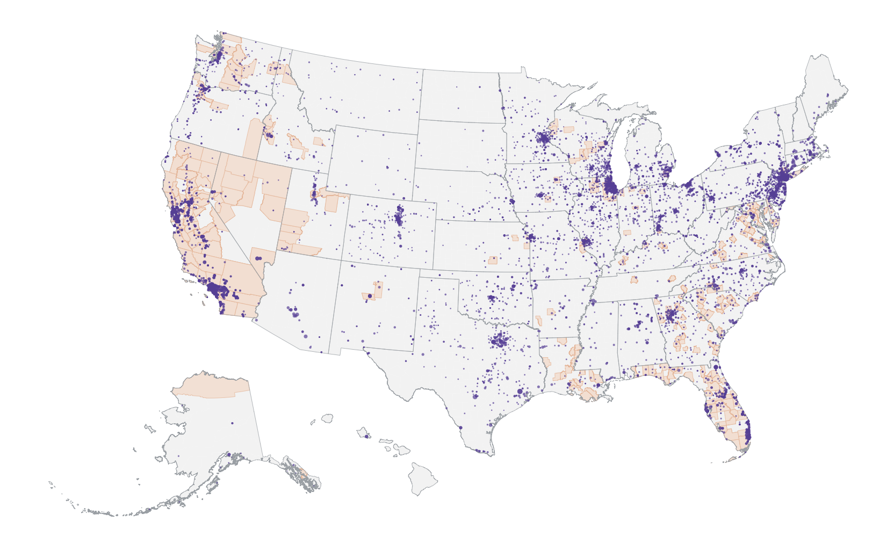
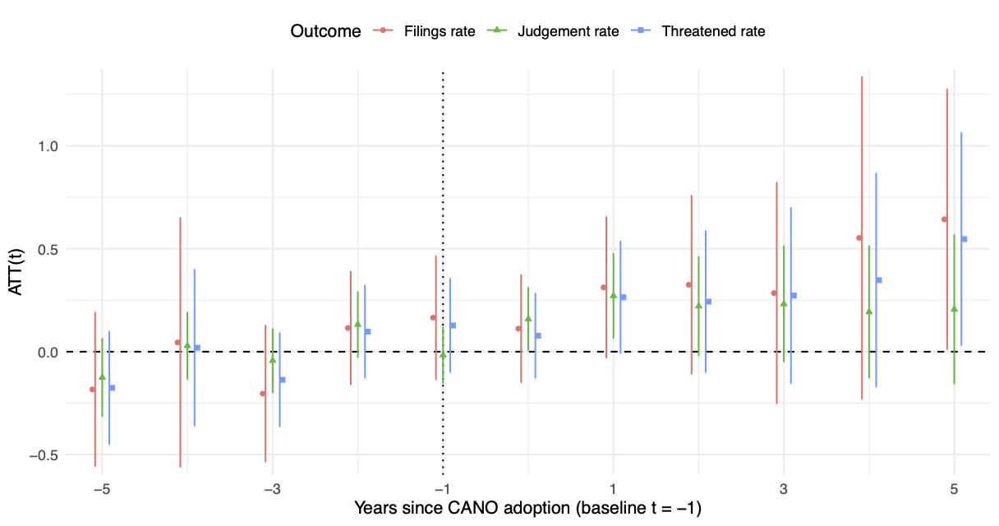

---
title: "Criminal Activity Nuisance Ordinance (CANO) Database"
subtitle: "Measuring the spread and design of property-based policing ordinances in U.S. local law"
date: "2024-01-01"
categories:
  - research
tags:
  - Local Governance
  - Large Language Models
summary: >
  Built a national database of Criminal Activity Nuisance Ordinances (CANOs) by collecting municipal codes,
  identifying relevant provisions at scale, and extracting structured policy attributes. The project links legal
  design to patterns in adoption and housing-related outcomes.

image:
  filename: "featured.png"
  caption: "CANO prevalence and policy design from municipal codes."
  focal_point: "Center"

project:
  status: "Work in progress"
  period: "2024–present"
  collaborators:
    - "Michele Valinoti"
    - "Bryant Moy"
    - "Moin Khan"

links:
  - icon: file-text
    name: Working paper
    url: "/publication/cano-database/"
  - icon: file-powerpoint
    name: Slides
    url: "/publication/cano-database/slides_chapter2_website.pdf"
  - icon: brands/github
    name: Code
    url: "https://github.com/michelevalinoti/CANO-Database"
---

## Overview

Criminal Activity Nuisance Ordinances (CANOs) are municipal laws that treat repeated “nuisance” incidents as a **property-level problem**, potentially shifting enforcement pressure onto property owners and residents. This project builds a national database of CANOs from municipal codes, enabling systematic evidence on where these ordinances exist, how they are written, and how they relate to adoption patterns and housing outcomes.

## Data & Pipeline

The database is built in three steps:

1. **Collection**: scrape and standardize municipal codes across multiple legal publishers.
2. **Classification**: identify CANO provisions using long-document NLP methods designed for legal text.
3. **Attribute extraction**: recover structured policy features (e.g., enforcement structure, owner obligations, eviction-related language, timing) from ordinance text using an LLM-based schema.

## Results & Takeaways

The database supports three high-level takeaways:

- **Widespread but uneven adoption**: CANOs are present in many jurisdictions, with substantial regional clustering and local variation in legal design.
- **Adoption correlates**: CANO incidence is systematically related to local demographic composition in a way consistent with a “threat”-style adoption pattern (without pinning the interpretation on any single mechanism).
- **Housing-facing associations**: linking adoption timing to outcome panels suggests stronger and more persistent associations with **housing instability measures** than with **public-safety measures**, especially where ordinances rely on eviction-related enforcement channels.

